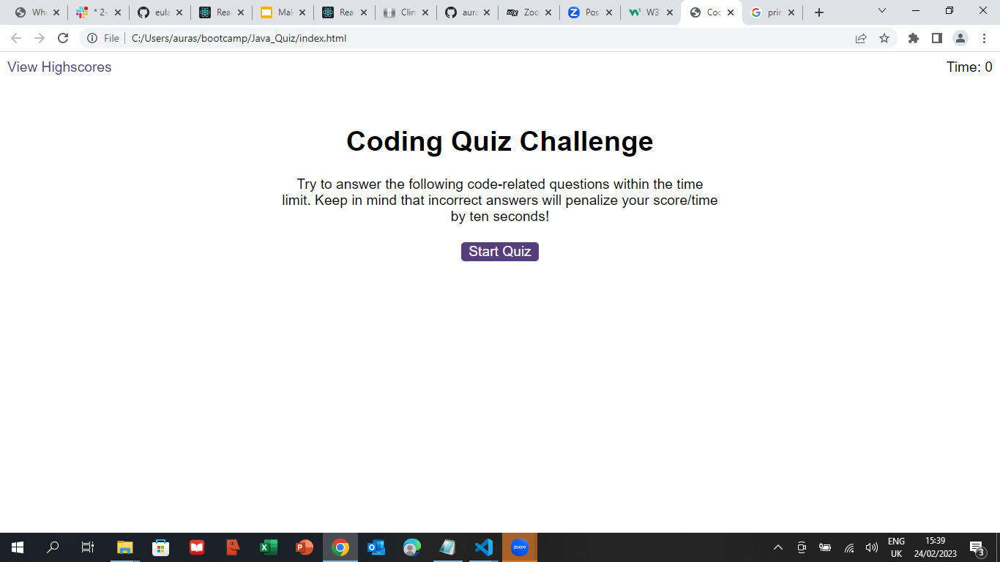

# Java_Quiz

## Description

For this project, i created a timed coding quiz with multiple-choice questions. This app will run in the browser, and will feature HTML and CSS powered by JavaScript code. It has a responsive user interface, easy to use and very intuitive.

## Instalation

The deployed link can be opened in browser

https:/auraely.github.io/Java_Quiz/

## Usage

Credits
N/A

Licence

MIT
